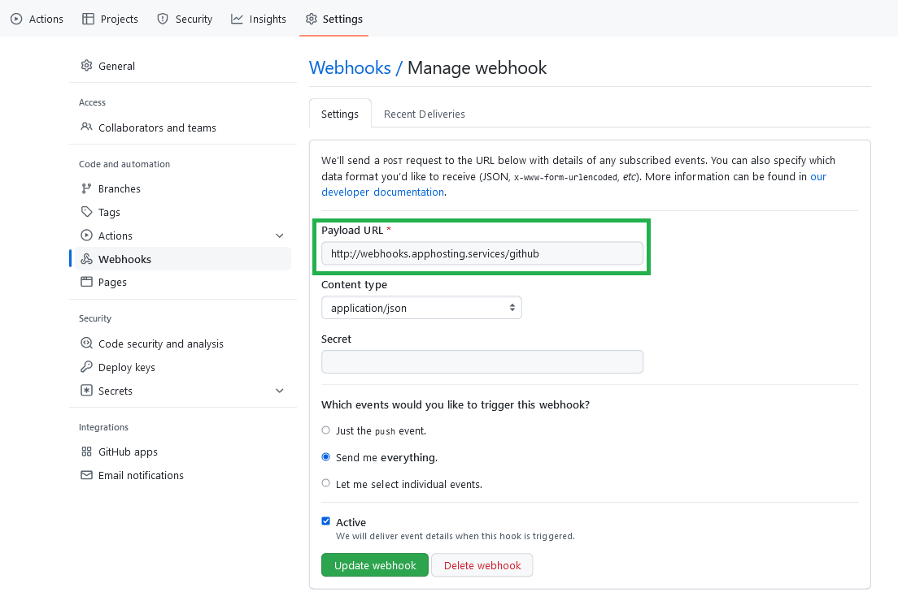

# About

This is a relay station for webhooks, currently predominantly GitHub and Slack.

This is also my first attempt at using an abstract factory pattern for easier extensibility.

This is a work in progress.

# Usage

1. Configure webhook for a GitHub repository (see Notes below).

2. Configure webhook for a Slack channel.
Check out the following resource for details:
https://api.slack.com/messaging/webhooks

3. Clone repository.

4. Create a `.env` file for:
   - `SLACK_RELAY_ENDPOINT`: The endpoint for all Slack messages (ex: "https://hooks.slack.com/services/{STRING1}/{STRING2}/{STRING3}").
   - `GITHUB_REPO`: Repository to monitor for changes (ex: "https://github.com/darren277/githubtoslack/").
   - `PORT`: Flask port.

5. Create a virtual environment.
   - For example, on Ubuntu:
   1. `python3 -m venv venv`.
   2. `source venv/bin/activate`.

6. Install dependencies.
   1. `pip3 install -r requirements.txt`.

7. Run `python3 main.py`.

# Notes

Mine is deployed on an AWS EC2 instance so that GitHub has a remote URL to send to.

Safely testing locally would almost require a tunneling service like ngrok.

# TODO

- Programmatically list endpoints.
- Proper exception handling and logging.
- Add more webhook types.

